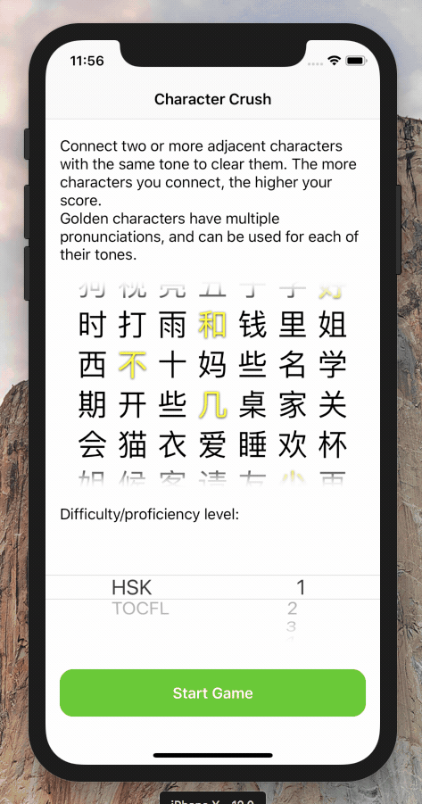
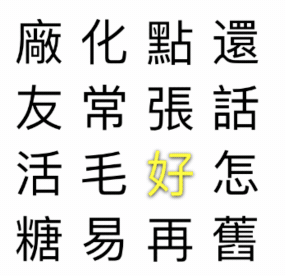

# Character Crush

## About

This is my app prototype for the [ChinesePod app challenge](https://chinesepod.app).
The app has not been released on the App Store yet.

Character Crush is a puzzle game with mechanics similar to popular mobile games e.g. [Cookie Cats](https://www.youtube.com/watch?v=iPxZIp0cbJE&t=1m10s).
However, instead of connecting items of the same color, the player must connect 3+ Chinese characters with the same *tone*.

Selected characters are highlighted using [tone-specific colors](https://chinesepod.com/blog/2017/04/17/learn-chinese-tones-properly/) (see item 4, this game follows Pleco's color scheme).
Characters with multiple tones (破音字) such as 好 (hǎo / hào) work like jokers, and can be used in a chain of either of their tones.

## How to Play This Game

This prototype is written using the Swift language and Apple's own SpriteKit frameworks, and it uses no third-party dependencies.

Simply download or clone this repository, open `CharacterCrush.pbxproj`, and run the game on an iPhone or iPad of your choice.

Note that some sound effects, and some visual effects (based on SpriteKit/Metal) do not work in the iPhone/iPad simulator.

## Possible Integration with ChinesePod

How would this app fit into the ChinesePod ecosystem?

* Right now the game pronounces selected characters using Apple's built-in text-to-speech engine (AVKit).
  Since [ChinesePod already has its own Pinyin pronunciation app](https://itunes.apple.com/us/app/pinyin-by-chinesepod/id833178097?mt=8), the game could use these higher-quality recordings.
* In addition to the current HSK and TOCFL difficulty levels, the game could use precisely those characters that the user has learned on ChinesePod. 

## Next Steps

There is always more to do. Here are a few ideas that didn't make it in time:

* Review the character database: am I missing any characters or tones?
* Play *all* pronunciations when selecting a character with multiple pronunciations, to aid the user in learning characters.
* Online highscore list, e.g. using Apple's free GameCenter API.
* Don't use Apple's system sound effects.
* Remember the last selected difficulty level.
* Support [other tone color schemes than Pleco's](http://laowaichinese.net/tone-colors-and-what-pleco-did-with-them.htm) in `Hanzi+RenderToTexture.swift`.
* Replace SpriteKit (plain UIKit would do the trick).
  Its physics engine quickly drains users' battery and has been quite troublesome.
* The game should actively avoid having the user get stuck with no moves left.
  Easiest solution: Refill the board with characters of the same tone when there are no moves left.

## License

Unlike most of my other repositories, this code is *not* provided under a permissive license.

Copyright © 2018 Julian Raschke. All rights reserved.
