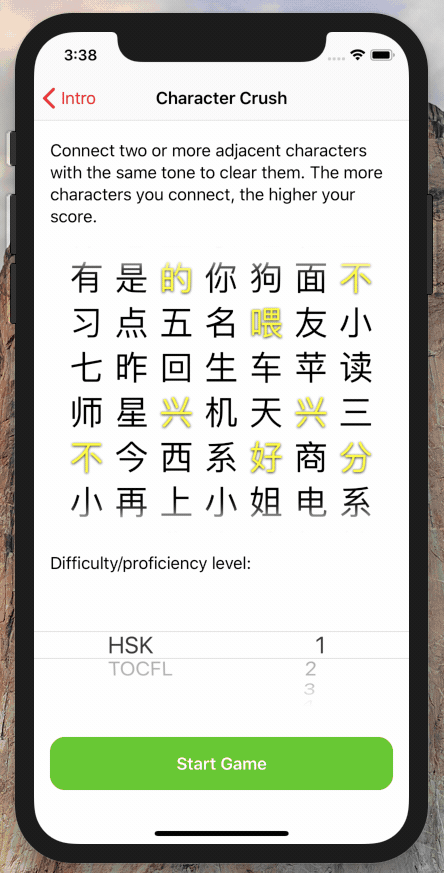
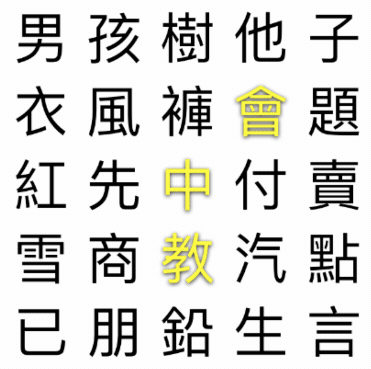
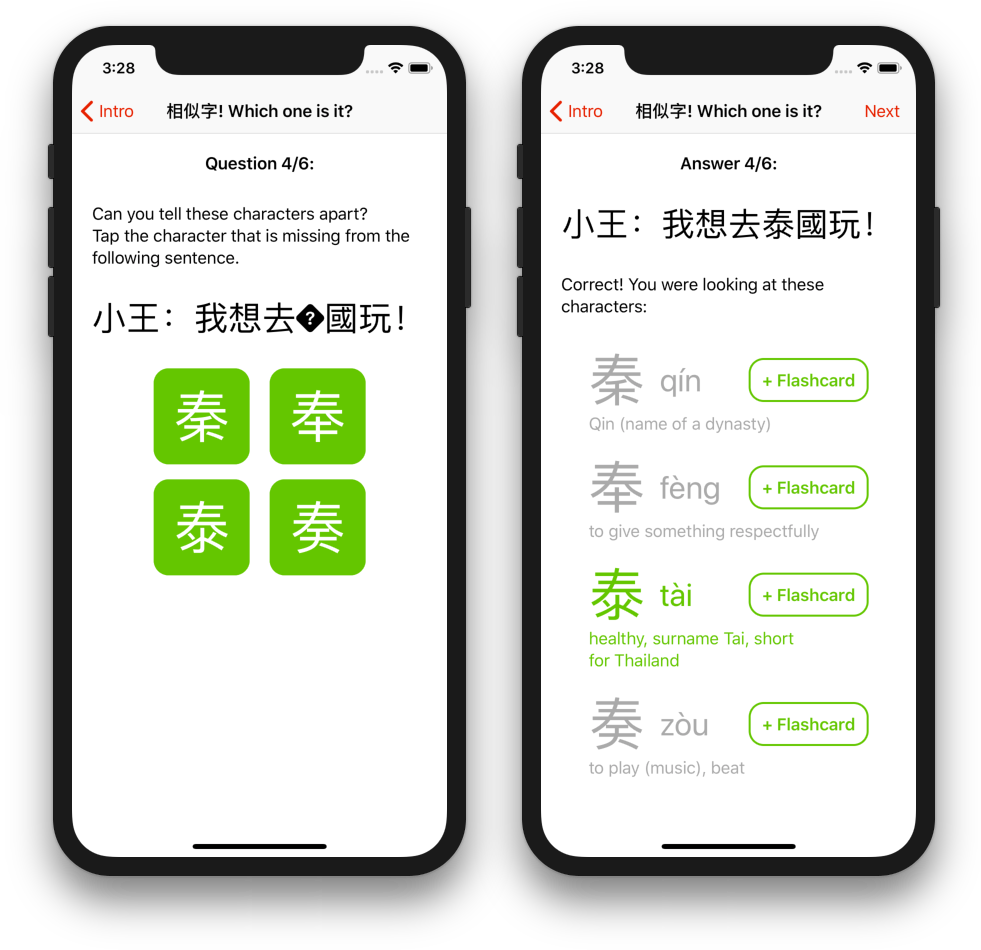

# My Entries for the [ChinesePod App Challenge](https://chinesepod.app)

This repository two iPhone/iPad app prototypes in a single Xcode project. 

Both prototype are written in Swift, and use no third-party code whatsoever.
Download or clone this repository, open `CharacterCrush.pbxproj`, and run the app on an iPhone or iPad of your choice.

(Some sound effects, and some visual effects do not work in the iPhone/iPad simulator.)

## Prototype 1: Character Crush

([Original mockup image](Mockups/CharacterCrush.png))

Character Crush is a puzzle game with mechanics similar to popular mobile games e.g. [Cookie Cats](https://www.youtube.com/watch?v=iPxZIp0cbJE&t=1m10s).
However, instead of connecting items of the same color, the player must connect 3+ Chinese characters with the same *tone*.

Selected characters are highlighted using [tone-specific colors](https://chinesepod.com/blog/2017/04/17/learn-chinese-tones-properly/) (see item 4, this game follows Pleco's color scheme).
Characters with multiple tones (破音字) such as 中 (zhōng / zhòng) work like jokers, and can be used in a chain of either of their tones.

### Possible Integration with ChinesePod

How would this app fit into the ChinesePod ecosystem?

* Right now the game pronounces selected characters using Apple's built-in text-to-speech engine (AVKit).
  Since [ChinesePod already has its own Pinyin pronunciation app](https://itunes.apple.com/us/app/pinyin-by-chinesepod/id833178097?mt=8), the game could use these higher-quality recordings.
* In addition to the current HSK and TOCFL difficulty levels, the game could use precisely those characters that the user has learned on ChinesePod. 

### Next Steps

There is always more to do. Here are a few ideas that didn't make it in time:

* The game should not have a time limit, but should reward forward planning instead.
  Maybe a turn limit would make things more interesting?
* Review the character database: Am I missing any characters or tones?
* Discuss: How should we deal with the silent tone? Should we add a fifth color for them?
* Play *all* pronunciations when selecting a character with multiple pronunciations, to aid the user in learning characters.
* Online highscore list, e.g. using Apple's free GameCenter API.
* Remember the last selected difficulty level.
* Support [other tone color schemes than Pleco's](http://laowaichinese.net/tone-colors-and-what-pleco-did-with-them.htm) in `Hanzi+RenderToTexture.swift`.
* Replace SpriteKit (plain UIKit would do the trick).
  Its physics engine quickly drains users' battery and has been quite troublesome.
* The game should actively avoid having the user get stuck with no moves left.
  Easiest solution: Refill the board with characters of the same tone when there are no moves left.

## Prototype 2: 相似字! Which one is it?

([Original mockup image](Mockups/WhichOneIsIt.png))

This prototype implements a very simple quiz game where the player has to pick one of several similar looking characters.

### Possible Integration with ChinesePod

How would this app fit into the ChinesePod ecosystem?

* The app could use example sentences from previous podcast episodes.
* Similarly, character definitions could be imported from the ChinesePod archives, instead of maintaining a dictionary in [`Questions.swift`](WhichOne/Questions.swift).
* The user should only be shown questions for characters that they have already learned.
* It would be convenient to create new flashcards from the "Answer" screen.
  (The buttons are already there, but don't do anything.)

### Next Steps

* Replace the current, boring UI with a more exciting interface, similar to Character Crush.
* Fix layout when showing three answers on iPhone (looks good on iPad).
* I have added a lot of similar-looking characters to [`Questions.swift`](WhichOne/Questions.swift).
  However, there are only six (terrible) example sentences right now.
  This app desperately needs more questions, and it should only ever ask ~10 questions in one setting.
* Support for Simplified Chinese (questions, definitions, …).

## License

Unlike most of my other repositories, this code is *not* provided under a permissive license.

Copyright © 2018 Julian Raschke. All rights reserved.
